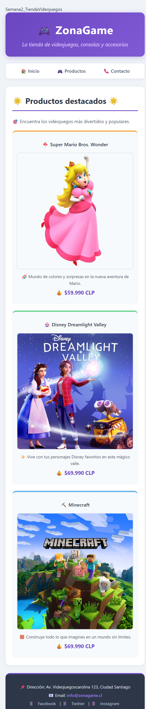
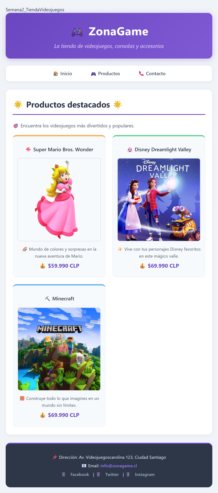
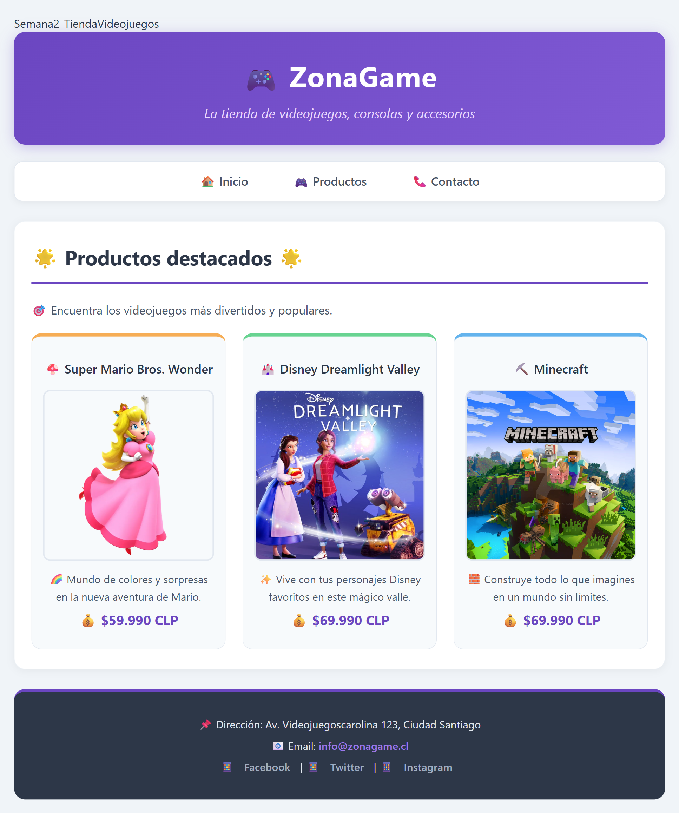
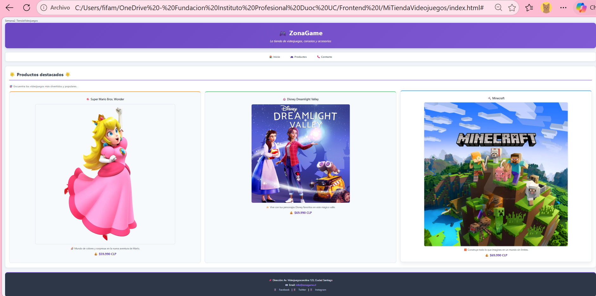
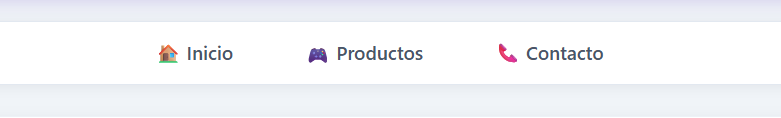
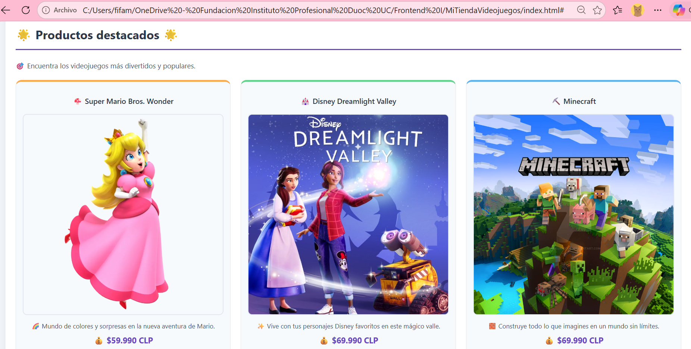
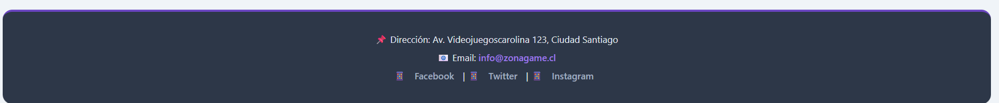
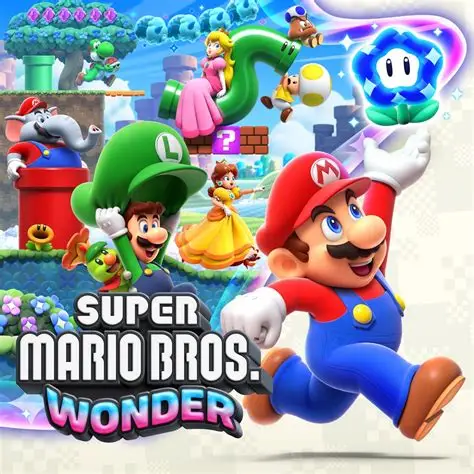
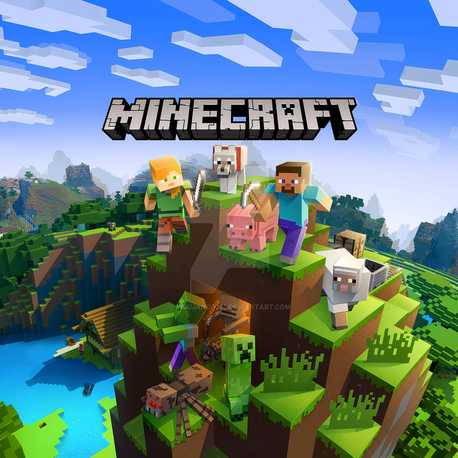

# 🎮 ZonaGame - Tienda de Videojuegos

## Actividad Sumativa 1 - Semana 3
### Optimizando un Sitio Web con HTML, CSS y Diseño Responsivo

---

## Descripción

Página web para una tienda de videojuegos llamada **"ZonaGame"**, optimizada visualmente con CSS y diseñada con un enfoque **responsivo** para adaptarse a diferentes dispositivos: móvil, tablet y escritorio.

La página utiliza:
- Etiquetas semánticas HTML
- Hoja de estilos CSS externa
- Modelo de cajas (padding, margin, border, box-sizing)
- Flexbox y CSS Grid para diseño responsivo
- Selectores avanzados (clases, ID, :hover, :nth-child, :last-child)
- Media Queries para adaptación a diferentes pantallas

---

## Estilos CSS implementados

### Modelo de cajas
## Actividad Semana 2 - Optimizando la página web con CSS

---

##  Descripción

Página web para una tienda de videojuegos llamada **"ZonaGame"**, optimizada visualmente con CSS como parte de la actividad formativa de la semana 2.

La página utiliza etiquetas semánticas HTML y una hoja de estilos CSS externa para mejorar la presentación visual.

---

##  Estilos CSS implementados

###  Modelo de cajas
- `padding` y `margin` para espaciado entre elementos
- `border` para delinear secciones y productos
- `box-sizing: border-box` para un control preciso del tamaño

### Colores y tipografías
- **Paleta de colores:** Morado (`#6b46c1`), gris (`#1a202c`), blanco (`#ffffff`)
- **Tipografía:** `Segoe UI` para mejor legibilidad
- **Tamaños de texto:** Jerarquía visual clara

### Selectores avanzados
###  Colores y tipografías
- **Paleta de colores:** Morado (`#6b46c1`), gris (`#2d3748`), blanco (`#ffffff`)
- **Tipografía:** `Segoe UI` para mejor legibilidad
- **Tamaños de texto:** Jerarquía visual clara

###  Selectores avanzados
- **Clases:** `.titulo-principal`, `.descripcion-tienda`, `.producto-item`, `.precio`
- **ID:** `#productos-destacados`
- **Pseudo-clases:** `:hover`, `:nth-child()`, `:last-child`

### Diseño responsivo
- **Flexbox:** Menú de navegación, header, footer
- **CSS Grid:** Productos destacados con `auto-fit` y `minmax`
- **Media Queries:** Adaptación para móvil, tablet y escritorio

---

## Estructura del proyecto
---

##  Estructura del proyecto
tienda-videojuegos-html/
├── index.html
├── README.md
├── css/
│ └── style.css
├── imagenes/
│ ├── mario.jpg
│ ├── disney.jpg
│ └── minecraft.jpg
└── capturas/
├── captura_movil.png
├── captura_tablet.png
└── captura_escritorio.png

---

## Capturas de pantalla

### 📱 Vista en dispositivo móvil

### 📟 Vista en tablet

### 🖥️ Vista en escritorio

├── captura1_vista_completa.png
├── captura2_menu_navegacion.png
└── captura3_productos_destacados.png

text

---

##  Capturas de pantalla

### Vista completa de la página

### Menú de navegación

### Productos destacados

### Pie de página

---

## Imágenes de productos

| Producto | Imagen |
|----------|--------|
| 🍄 Super Mario Bros. Wonder |  |
| 🏰 Disney Dreamlight Valley |  |
| ⛏️ Minecraft |  |

---

## Tecnologías utilizadas

| Tecnología | Descripción |
|------------|-------------|
| **HTML5** | Estructura semántica de la página |
| **CSS3** | Estilos, diseño responsivo y animaciones |
| **Flexbox** | Organización de elementos horizontales |
| **CSS Grid** | Distribución de productos y secciones |
| **GitHub Pages** | Publicación del sitio en línea |

---

## Enlaces

- **Repositorio:** https://github.com/carosolis45/tienda-videojuegos-html
- **GitHub Pages:** https://carosolis45.github.io/tienda-videojuegos-html/

---

## Datos del estudiante

- **Nombre:** Carolina Solís
- **Curso:** Frontend I
- **Semana:** 3 - Sumativa 1
- **Fecha:31 Agosto 2026

---

*Actividad realizada para la asignatura de Frontend I - Sumativa 1 (Semana 3)*
## URL del sitio:

https://carosolis45.github.io/tienda-videojuegos-html/

