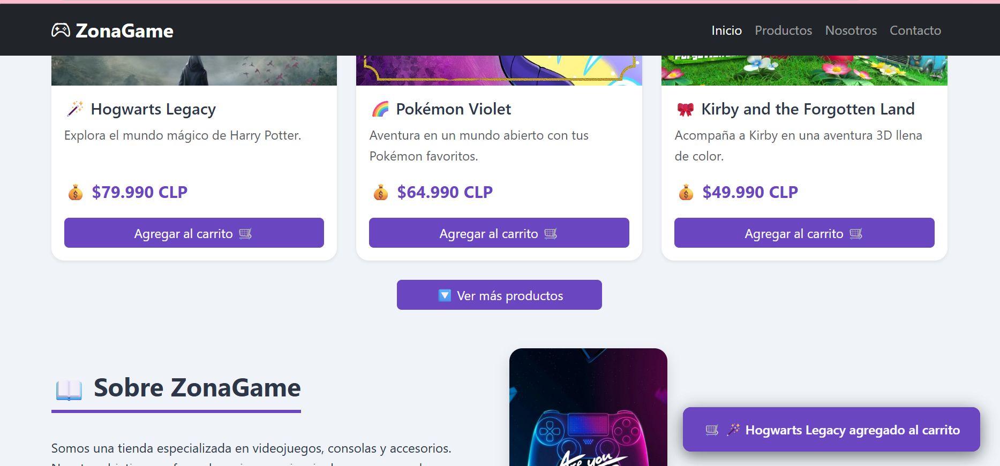

# ZonaGame - Tienda de Videojuegos

## Actividad Formativa - Semana 5
### Manipulando el DOM con JavaScript para Mejorar la Interactividad

---

## Descripción

Página web para una tienda de videojuegos llamada **"ZonaGame"**, mejorada con **JavaScript** para agregar interactividad dinámica mediante la manipulación del DOM, eventos y la Fetch API.

---

## Funcionalidades implementadas

### Manipulación del DOM
- Selección dinámica de elementos con `querySelector` y `querySelectorAll`
- Creación de nuevas tarjetas con `createElement` y `appendChild`
- Actualización dinámica de contenido con `innerHTML`

### Eventos (click, mouseover, submit)
- **Click** en botones "Agregar al carrito" → muestra notificación
- **Click** en "Ver más productos" → carga productos dinámicamente
- **Mouseover** en tarjetas → efecto de elevación
- **Submit** en formulario → valida y muestra mensaje de agradecimiento

### Fetch API
- Carga de productos desde `data/productos.json`
- Manejo de promesas con `.then()` y `.catch()`
- Renderizado dinámico en el DOM
- Manejo de errores

### Buenas prácticas
- Código organizado en funciones con nombres claros
- Comentarios explicativos en cada sección
- Separación de responsabilidades (CSS, HTML, JS)
- CSS externo (`css/style.css`) siguiendo la sugerencia del profesor

---

## Estilos CSS implementados

### CSS externo (Sugerencia del profesor)
- Hoja de estilos separada en `css/style.css`
- Mantenimiento más fácil, mejor caché y separación de responsabilidades

### Paleta cromática
- Morado principal: `#6b46c1`
- Morado claro: `#805ad5`
- Morado hover: `#b794f4`
- Gris oscuro: `#1a202c`

### Diseño responsivo
- **Flexbox** y **CSS Grid** vía Bootstrap 5
- **Media Queries** personalizadas
- Adaptación a móvil, tablet y escritorio

---

## Estructura del proyecto
```text
tienda-videojuegos-html/
├── index.html
├── README.md
├── css/
│ └── style.css
├── data/
│ └── productos.json
├── js/
│ └── script.js
├── imagenes/
│ ├── mario.jpg
│ ├── disney.jpg
│ ├── minecraft.jpg
│ ├── hogwarts.jpg
│ ├── pokemon.jpg
│ └── kirby.jpg
└── capturas/
├── captura_movil.png
├── captura_tablet.png
├── captura_escritorio.png
├── captura_dom.png
├── captura_productos_dinamicos.png
└── captura_notificacion.png

```

---

## Capturas de pantalla

### Vista en dispositivo móvil


### Vista en tablet


### Vista en escritorio


### Productos cargados dinámicamente (Fetch API)


### Notificación al agregar al carrito


---

## 🖼️ Imágenes de productos

| Producto | Imagen |
|----------|--------|
| Super Mario Bros. Wonder |  |
| Disney Dreamlight Valley |  |
| Minecraft |  |
| Hogwarts Legacy |  |
| Pokémon Violet |  |
| Kirby and the Forgotten Land |  |

---

## Tecnologías utilizadas

| Tecnología | Descripción |
|------------|-------------|
| **HTML5** | Estructura semántica de la página |
| **Bootstrap 5** | Framework CSS para diseño responsivo |
| **CSS3** | Estilos personalizados externos |
| **JavaScript (ES6+)** | Manipulación del DOM, eventos y Fetch API |
| **JSON** | Fuente de datos externa para productos |
| **GitHub Pages** | Publicación del sitio en línea |

---

## Enlaces

- **Repositorio:** https://github.com/carosolis45/tienda-videojuegos-html
- **GitHub Pages:** https://carosolis45.github.io/tienda-videojuegos-html/

---

## Datos del estudiante

- **Nombre:** Carolina Solís
- **Curso:** Frontend I
- **Semana:** 5 - Formativa
- **Fecha:** 14 Septiembre 2026

---

*Actividad realizada para la asignatura de Frontend I - Formativa (Semana 5)*
