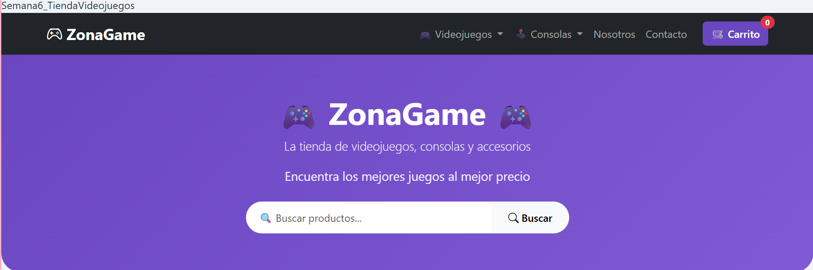
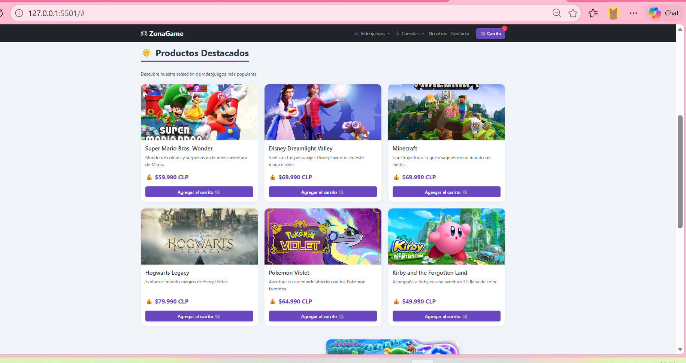
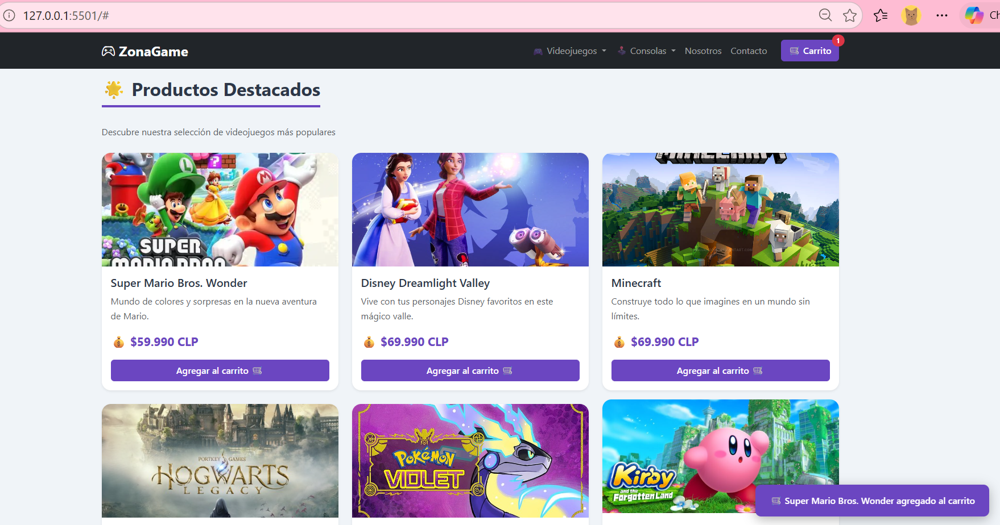
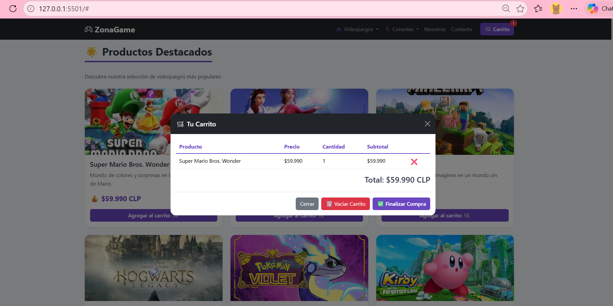
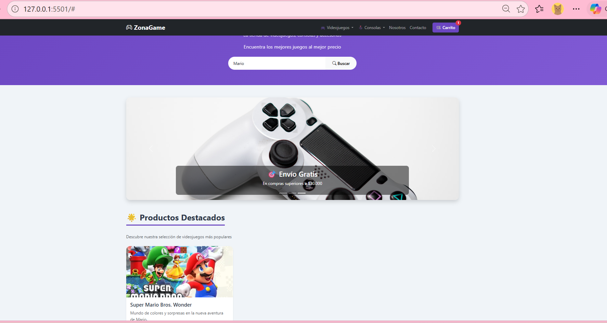
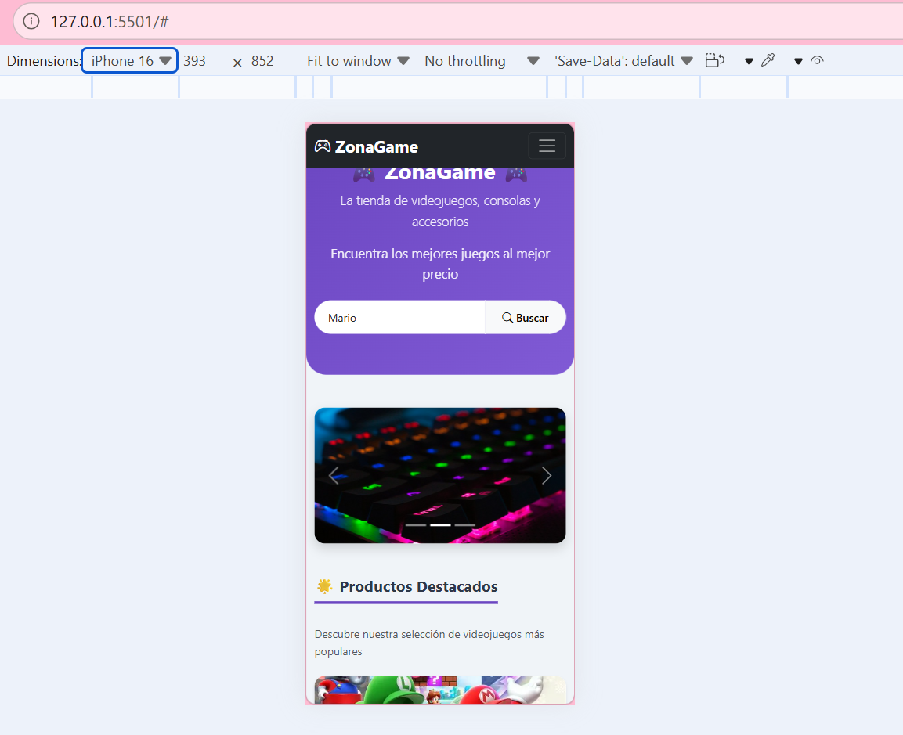
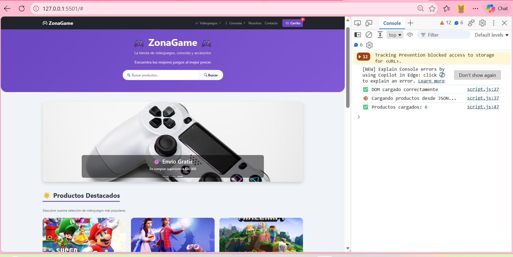
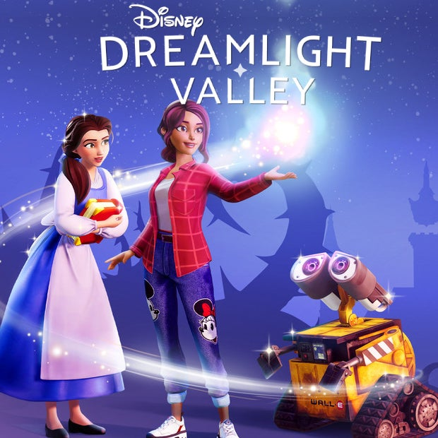
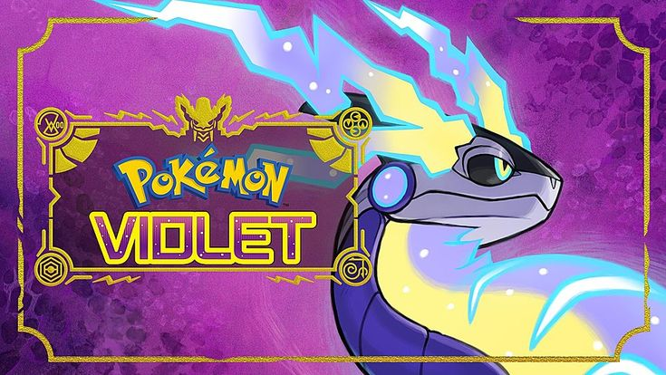

# 🎮 ZonaGame - Tienda de Videojuegos

## 📌 Actividad Sumativa - Semana 6
### Optimizando la lógica y rendimiento de una página web con JavaScript

---

## 📋 Descripción

Página web para una tienda de videojuegos llamada **"ZonaGame"**, que combina **Bootstrap 5** y **JavaScript** para ofrecer una experiencia de usuario interactiva, moderna y responsiva.

La página incluye un **carrito de compras funcional**, un **buscador de productos** y **carga dinámica de datos** mediante la Fetch API.

---

## 🎯 Funcionalidades implementadas

### ✅ Optimización con Bootstrap 5
- **Navbar responsiva** con dos categorías simuladas:
  - 🎮 Videojuegos (con dropdown: Aventura, RPG, Sandbox)
  - 🕹️ Consolas (con dropdown: PlayStation, Xbox, Nintendo)
- **Carrito de compras** con contador en la navbar
- **Sistema de Grid** para organizar los productos
- **Cards** de Bootstrap para cada producto
- **Footer** con información de contacto y redes sociales
- Diseño 100% responsive (móvil, tablet y escritorio)

### ✅ Interactividad con JavaScript
- **Evento CLICK** en botones "Agregar al carrito" → agrega productos y muestra notificación
- **Evento SUBMIT** en formulario de búsqueda → filtra productos por texto
- **Evento SUBMIT** en formulario de contacto → envía mensaje
- **Carrito completo:** agregar, eliminar, vaciar y finalizar compra
- **Modal del carrito** con tabla de productos, cantidades y total

### ✅ Manipulación dinámica del DOM
- Creación de tarjetas con `createElement` y `appendChild`
- Renderizado dinámico de productos
- Actualización del contador del carrito
- Cálculo automático del total
- Notificaciones flotantes animadas

### ✅ Fetch API
- Carga de productos desde `assets/data/productos.json`
- Manejo de promesas con `.then()` y `.catch()`
- **Manejo de errores:** muestra un mensaje amigable si falla la carga
- Spinner de carga mientras obtiene los datos

### ✅ Buenas prácticas
- Código JavaScript dividido en **funciones reutilizables**
- **Comentarios explicativos** en cada sección
- Separación de responsabilidades (`assets/css/`, `assets/js/`, `assets/data/`)
- Estructura de carpetas profesional con `assets/`

---

## 🎨 Estilos CSS implementados

### ✅ CSS externo
- Hoja de estilos separada en `assets/css/style.css`
- Mantenimiento más fácil y separación de responsabilidades

### ✅ Paleta cromática
- Morado principal: `#6b46c1`
- Morado claro: `#805ad5`
- Morado hover: `#b794f4`
- Gris oscuro: `#1a202c`
- Gris claro: `#f0f4f8`

### ✅ Diseño responsivo
- **Bootstrap 5** con Grid System
- **Media Queries** personalizadas
- Adaptación a móvil, tablet y escritorio

---

## 📁 Estructura del proyecto

```text
tienda-videojuegos-html/
├── index.html
├── README.md
├── assets/
│   ├── css/
│   │   └── style.css
│   ├── data/
│   │   └── productos.json
│   ├── js/
│   │   └── script.js
│   └── imagenes/
│       ├── mario.jpg
│       ├── disney.jpg
│       ├── minecraft.jpg
│       ├── hogwarts.jpg
│       ├── pokemon.jpg
│       └── kirby.jpg
└── capturas/
    ├── semana6_captura1_estructura.png
    ├── semana6_captura2_productos.png
    ├── semana6_captura3_notificacion.png
    ├── semana6_captura4_carrito.png
    ├── semana6_captura5_buscador.png
    ├── semana6_captura6_movil.png
    └── semana6_captura7_consola.png
```

---
## 📸 Capturas de pantalla

### Estructura de la página (Navbar + Hero + Buscador)


### Productos cargados dinámicamente (Fetch API)


### Notificación al agregar al carrito


### Modal del carrito con productos


### Buscador en acción


### Vista responsive en móvil


### Consola sin errores


## Imágenes de productos

| Producto | Imagen |
|----------|--------|
| 🍄 Super Mario Bros. Wonder |  |
| 🏰 Disney Dreamlight Valley |  |
| ⛏️ Minecraft |  |
| 🪄 Hogwarts Legacy |  |
| 🌈 Pokémon Violet |  |
| 🎀 Kirby and the Forgotten Land |  |

---
Tecnologías utilizadas
Tecnología	Descripción
HTML5	Estructura semántica de la página
Bootstrap 5	Framework CSS para diseño responsivo
CSS3	Estilos personalizados externos
JavaScript (ES6+)	Carrito, buscador, eventos y Fetch API
JSON	Fuente de datos externa para productos
GitHub Pages	Publicación del sitio en línea

---
🔗 Enlaces
Repositorio: https://github.com/carosolis45/tienda-videojuegos-html

GitHub Pages: https://carosolis45.github.io/tienda-videojuegos-html/

---

Datos del estudiante
Nombre: Carolina Solís

Curso: Frontend I

Semana: 6 - Sumativa

Fecha: 21 Septiembre 2026

Actividad Sumativa (Semana 6)